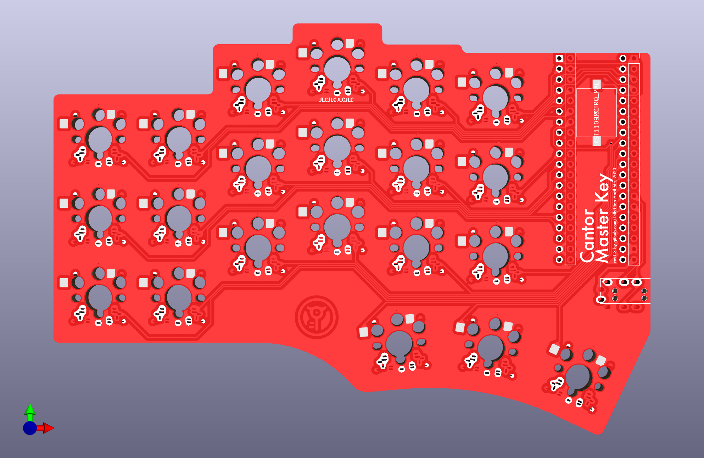
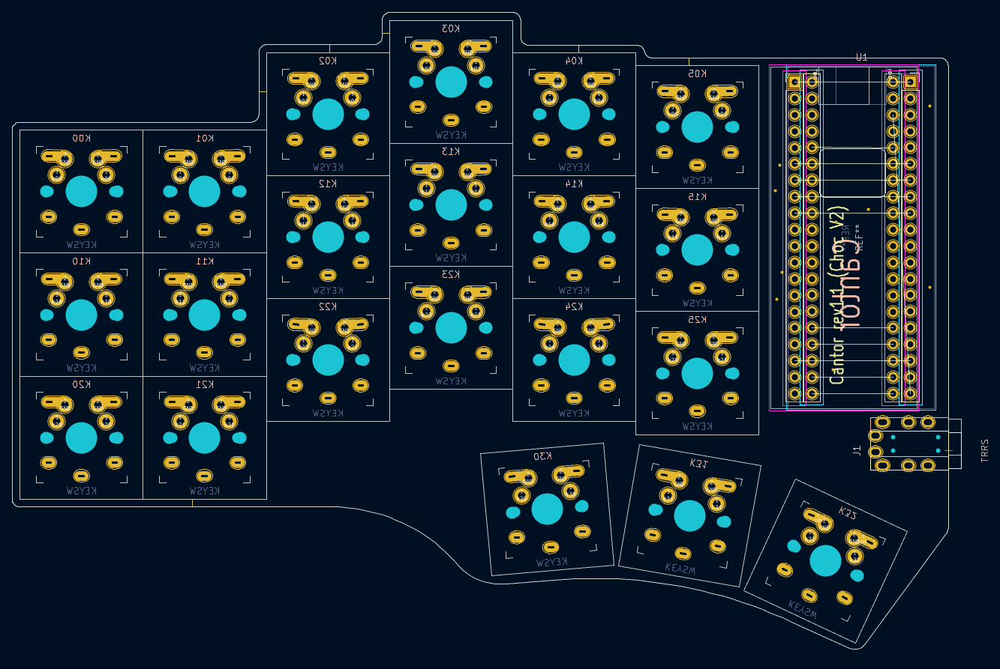
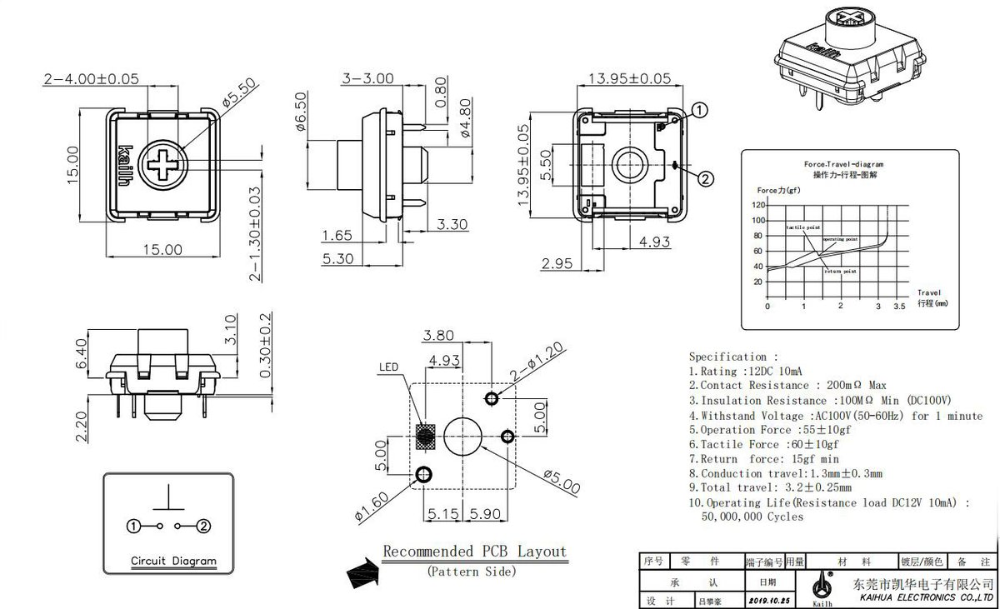
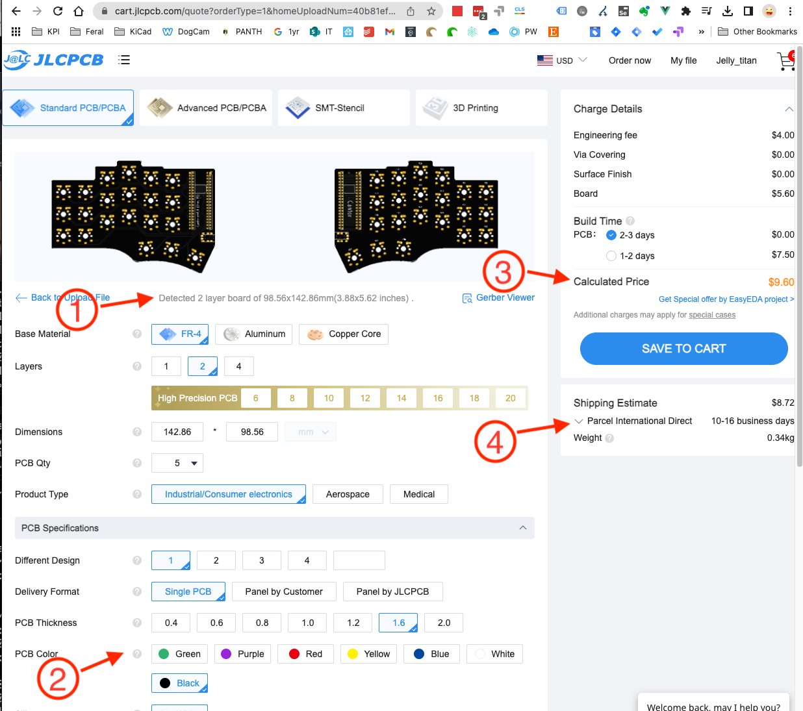

# Cantor Master Key (Formerly 'Cantor MX')
This is a Cantor variant adjusted to support multiple switches, add hot swop kailh V1 & V2 sockets, and add a speaker.

This version 1.3 **(UNTESTED)** currently supports:
* Cherry MX full size 5 pin only. (Aka "[PCB mount](https://deskthority.net/wiki/Switch_mount)")
* [Cherry MX Low profile](https://www.cherrymx.de/en/cherry-mx/mx-low-profile/mx-low-profile-red.html) (Aka "MXLP") 
* [Gateron Low Profile](https://www.gateron.co/products/gateron-low-profile-mechanical-switch-set) (KS-27)
* [Kailh Choc V1](http://www.kailh.com/en/Products/Ks/CS/321.html) (PG1350) - Can use hotswap sockets or be soldered in.
* [Kailh Choc V2](http://www.kailh.com/en/Products/Ks/CS/757.html) (PG1353) - Can use hotswap sockets or be soldered in.
* [TTC KS32](https://deskthority.net/wiki/TTC_KS32_series) (Cherry MX Low Profile Clones)
* RedDragon MX Low profile (No data sheet available - these probably don't work?) 

This version _does not_ support
* Cherry MX full size 3 pin, aka "[Plate mount](https://deskthority.net/wiki/Switch_mount)". (Only 2 good points of contact, so it's too wiggly. Would need a plate).
* [Kailh Notebook "X" Scissor](http://www.kailh.com/en/Products/Ks/NotebookS/649.html) (CPG142501D02) The corner mounting holes conflict with Kailh V2 corner pin. That pin is not electrically relevent, but helps with orientation. Maybe add this in the future?
* Cherry MX [Ultra low profile](https://www.cherrymx.de/en/cherry-mx/mx-ultra-low-profile/mx-ulp-click.html) (Too hard to find).

All of these except the Choc V1s will use MX keycaps. MX keycaps are slightly larger than Choc V1 caps that are used in the original cantor so the layout has been adjusted accordingly. None of the routing has changed, so any Cantor V1.0 firmware will work with the board.

* V1.1 (pcb/gerbers/Cantor_MXv1.1.zip) has been produced with JLCPCB and confirmed to work. This only supports choc v1, choc v2, and MX full size switches. When using full size cherry MX switches, the 5 pin is recommended because the center hole is enlarged to support Kailh Chocs, so the 3 pin full size cherry MX switch will be unstable. It's still workable, but you'll likely have a few tilted keys, or need to create a plate.
* V1.3 Is a work in progress and has not been validated. This version has additonal key support. I threw in a piezo speaker too because, why not?
Improved pin hole dimensions for 3 pin cherry MX stability. Moved TRRS jack to allow for larger thumb cluster keycaps.

Todo:
* Updated the licensing?
* Update schematic for TX/RX TRRS Crossover.
* ~~Should this be updated for the pi2040 (Currently uses blackpill 401).~~ There is already a "Piantor". If this footprint works, make a mash up. 
* On test print 1.3, red was extra, so i went with blue. Try Elecrow next time?
* On test print 1.3, 4-6-23, jlcpcb charged an extra $7.50USD for having an abundance of slots. Try elecrow, or reduce slots. Maybe make the blackpill flippable to reduce by 40 apertures? (Pulling red dragon only reduces by 21 slots, since it shares a ground).

V1.3

V1.1

## How to order this board from a PCB vendor.

Helpful info if it's your first time ordering a PCB.

Most PCB vendors have a similar ordering process. I use [JLCPCB](https://jlcpcb.com/) because they are usually the most cost effective. I've had good luck with [Elecrow](https://www.elecrow.com/) too. [You can find PCB price comparison tools online.](https://pcbshopper.com/) When comparing pricing, the board dimensions are 99 x 143mm. (Usually anything under 100x100mm is really cheap - so be sure to use those dimensions when pricing).

The production files are known as "gerbers", and they are usually uploaded as a `.zip` file. (It's essentially a collection of files for each layer of the board, like holes, graphics, traces etc.) In this repo, the file is at `cantor-choc-V2/pcb/Gerbers_ChocV2/Cantor_Choc_V2.zip`. (File & path name may change during development)

@todo - revise path before pull request.

The homepage of JLCPCB has a drag & drop upload. Drag the gerber `.zip` and drop it on the "add gerber file" box.

While the file is uploading, it will take you to an options screen. Once the board size is detected1, the price3 will update accordingly.
Changing the pcb color2 may impact production time and price.
Shipping estimates4 can vary widely, so be sure to check those. (You'll see these options again during checkout).

It's worth noting, the default pcb surface finish contains Lead. For boards in cases, this is usually not a problem. If you're going to rock a naked board, consider going with "lead free" for a few bucks more.

`@todo - Site sources?`

The remainder of the checkout process is standard ecommerce stuff. After you pay for your order, it will be reviewed before going into production. They will let you know if the file has any issues.

# Cantor Keyboard
The Cantor keyboard is a 42 key diodeless split keyboard, designed with simplicity in mind. It is inspired on the popular [corne](https://github.com/foostan/crkbd), [ferris](https://github.com/pierrechevalier83/ferris) and [sweep](https://github.com/davidphilipbarr/Sweep) keyboards, aiming to provide a more ergonomic (stronger column stagger) corne-like layout with a simple, easy to assemble and cheap design.

The keyboard uses choc switches with choc spacing. Therefore, only MBK keycaps can be used.

### Why diodeless?

A diodeless design reduces the keyboard assembly time, as the amount of components to solder is significantly reduced.
Moreover, soldering diodes can cause trouble during the keyboard build. Diodes need to be placed in the correct direction, if not, the keys won't work well!
Eliminating diodes will prevent many errors during the assembly process.

## Disclaimers

All the designs and files are provided "AS IS" without any warranty or support.

## Design philosophy

The Cantor is designed with the following goals:

- Comfort
- Powerful
- Low cost
- Simplicity
- Ease of build
- USB-C
- No diodes

The PCB is reversible to reduce manufacturing costs.

## Getting started

Would you like to build this keyboard? Then continue reading!

You can also buy a kit to build the Cantor keyboard from one of the **honorable sponsors**:

    

### Bill of Materials

To build the keyboard, you will need the following materials:

- 2x PCB boards (both are equal since they are reversible)
- 2x STM32F401CC blackpill microcontrollers (they are cheap on aliexpress)
- Pins and sockets for the microcontrollers (blackpill needs 20 pin stripes)
- 42 Choc v1 switches
- 42 MBK keycaps
- Some little rubber feet/bumpers (recommended 6 mm of diameter)
- 2x TRRS jacks (PJ-320A)
- 1x TRRS cable
- 1x USB cable compatible with your computer and the blackpill

### Order the PCB

Download the gerber file from realeses, and submit it to your favorite PCB manufacturer. The keyboard designs have been tested with JLCPCB.

Note: if you don't want a random tracking number to be printed in the PCB, make sure to select the option 'Remove Order Number' in JLCPCB.

### How to Build

To build the keyboard, you'll also need a soldering iron and some tin. Follow the [build guide](doc/build_guide.md).

### Firmware

The Cantor keyboard uses the QMK firmware. Firmware for this keyboard is coming soon to the main QMK repository with [this PR](https://github.com/qmk/qmk_firmware/pull/16552).

To flash the firmware to the microcontroller connect the blackpill to your computer and set it to bootloader mode. To do this the first time:

1. Press and hold the BOOT0 button.
2. Press and release the NRST button.
3. Release the BOOT0 button.

The following times you want to flash the keyboard, it is much simpler thanks to bootmagic. Hold the top left key of the keyboard and plug the microcontroller. If flashing the right part, hold the top right key.

## Feedback

If you have build this keyboard, please fill [this form](https://forms.gle/nfJCsei5hyHbjaHn9) to provide feedback. This will help to improve the keyboard design in future revisions.

Also, you can open an issue reporting any problem or feature request.

## Support

The development of a keyboard takes time and money. If you like this keyboard a want to support me for the work and to develop future revisions of the keyboard, consider donating:

PayPal: 
GitHub: [Here](https://github.com/sponsors/diepala)

### Honorable sponsors

Thank you very much to everyone contributing and/or sonponsoring this project. Special thanks to the honorable sponsors:

